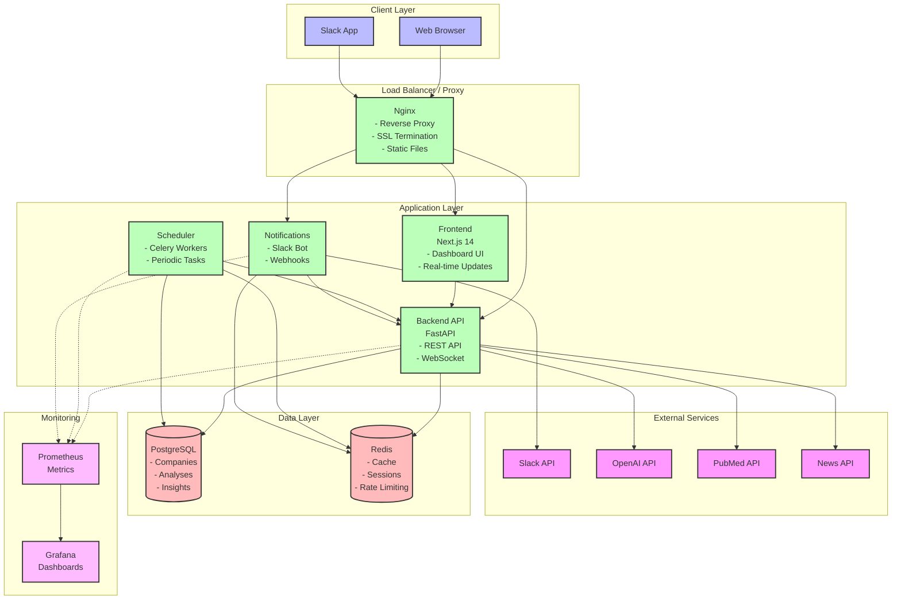
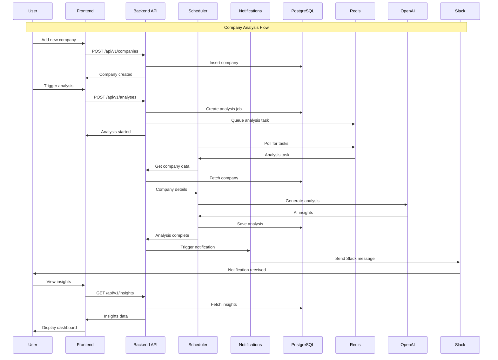
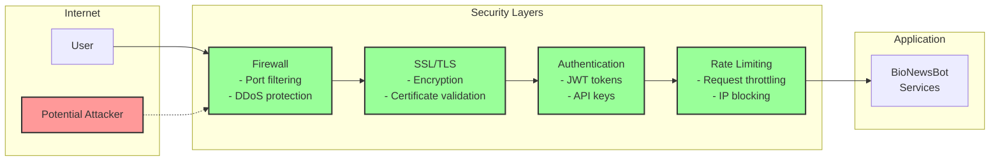

# BioNewsBot Architecture

## System Architecture Diagram

## Data Flow Diagram

## Component Details

### Frontend (Next.js)
- **Purpose**: User interface for monitoring and management
- **Features**:
  - Real-time dashboard
  - Company management
  - Analysis visualization
  - Insight reports
- **Technologies**: Next.js 14, TypeScript, Tailwind CSS, Chart.js

### Backend API (FastAPI)
- **Purpose**: Core business logic and API endpoints
- **Features**:
  - RESTful API
  - WebSocket support
  - Authentication/Authorization
  - Data validation
- **Technologies**: FastAPI, Python 3.11, SQLAlchemy, Pydantic

### Scheduler (Celery)
- **Purpose**: Asynchronous task processing
- **Features**:
  - Periodic analysis runs
  - Background processing
  - Task retry logic
  - Schedule management
- **Technologies**: Celery, APScheduler, Python 3.11

### Notifications (Slack Bot)
- **Purpose**: Alert delivery and user notifications
- **Features**:
  - Slack integration
  - Webhook handling
  - Rate limiting
  - Message formatting
- **Technologies**: FastAPI, Slack SDK, Python 3.11

### Database (PostgreSQL)
- **Purpose**: Primary data storage
- **Schema**:
  - Companies
  - Analyses
  - Insights
  - Users
  - Audit logs
- **Features**: JSONB storage, UUID keys, Triggers

### Cache (Redis)
- **Purpose**: Performance optimization
- **Usage**:
  - API response caching
  - Session storage
  - Rate limiting
  - Task queue
- **Features**: Persistence, Pub/Sub

## Security Architecture

