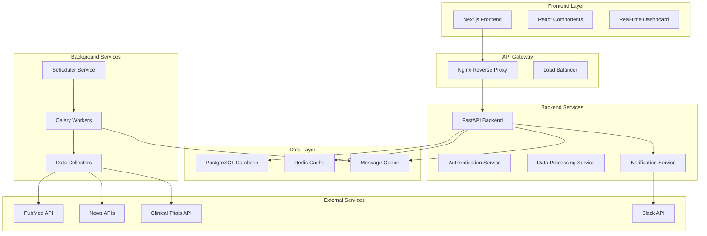

# 🧬 BioNewsBot - AI-Powered Life Sciences Intelligence Platform

<div align="center">
  

  <p align="center">
    <strong>Transform life sciences data into actionable intelligence with AI-powered monitoring and analysis</strong>
  </p>

  [](https://github.com/romwil/bionewsbot/actions/workflows/ci.yml)
  [](https://github.com/romwil/bionewsbot/actions/workflows/security.yml)
  [](https://github.com/romwil/bionewsbot/actions/workflows/cd.yml)
  [](https://opensource.org/licenses/MIT)
  [](https://www.docker.com/)
  [](https://www.python.org/)
  [](https://fastapi.tiangolo.com)
  [](https://nextjs.org/)
</div>

---

## 📋 Table of Contents

- [Overview](#overview)
- [Features](#features)
- [Architecture](#architecture)
- [Quick Start](#quick-start)
- [API Documentation](#api-documentation)
- [Configuration](#configuration)
- [Contributing](#contributing)
- [License](#license)

## 🎯 Overview

BioNewsBot is an enterprise-grade AI-powered platform that monitors, analyzes, and delivers real-time insights about biotechnology companies. By aggregating data from scientific publications, news sources, clinical trials, and market intelligence, BioNewsBot provides comprehensive intelligence for life sciences professionals, investors, and researchers.

## ✨ Features

### 🤖 AI-Powered Intelligence
- **Natural Language Processing**: Advanced NLP for extracting insights from scientific literature and news
- **Sentiment Analysis**: Real-time sentiment tracking for companies and their products
- **Entity Recognition**: Automatic identification of companies, drugs, diseases, and key personnel
- **Trend Detection**: AI-driven identification of emerging trends and patterns
- **Predictive Analytics**: Machine learning models for forecasting company developments

### 📊 Data Aggregation & Analysis
- **Multi-Source Integration**: Aggregates data from PubMed, clinical trials, news outlets, and financial sources
- **Real-Time Monitoring**: Continuous scanning of new publications and announcements
- **Custom Alerts**: Configurable notifications for specific companies, keywords, or events
- **Historical Analysis**: Track company evolution and milestone achievements over time
- **Competitive Intelligence**: Side-by-side company comparisons and market positioning

### 🔔 Smart Notifications
- **Slack Integration**: Real-time alerts delivered directly to your Slack channels
- **Customizable Triggers**: Set up alerts based on keywords, sentiment changes, or specific events
- **Digest Reports**: Daily/weekly summaries of key developments
- **Priority Filtering**: AI-powered importance scoring to highlight critical updates

### 🛠️ Technical Features
- **RESTful API**: Comprehensive API for programmatic access
- **Microservices Architecture**: Scalable, maintainable service-oriented design
- **Real-Time Updates**: WebSocket support for live data streaming
- **Advanced Caching**: Redis-powered caching for optimal performance
- **Scheduled Tasks**: Celery-based task scheduling for automated data collection
- **Docker Support**: Full containerization for easy deployment
- **PostgreSQL Database**: Robust data storage with full-text search capabilities

## 🏗️ Architecture

<div align="center">
  
</div>



### Microservices Overview

| Service | Technology | Purpose |
|---------|------------|----------|
| Frontend | Next.js 14 | Modern React-based UI with SSR/SSG |
| Backend API | FastAPI | High-performance REST API |
| Database | PostgreSQL 15 | Primary data storage |
| Cache | Redis 7 | Session management & caching |
| Task Queue | Celery | Asynchronous task processing |
| Scheduler | Celery Beat | Periodic task scheduling |
| Notifications | Custom Service | Slack integration & alerts |
| Reverse Proxy | Nginx | Load balancing & SSL termination |

## 🚀 Quick Start

### Prerequisites

- Docker Engine 20.10+
- Docker Compose 2.0+
- 8GB RAM minimum
- 20GB free disk space
- Git

### Installation

1. **Clone the repository**
   ```bash
   git clone https://github.com/romwil/bionewsbot.git
   cd bionewsbot
   ```

2. **Configure environment**
   ```bash
   cp .env.example .env
   # Edit .env with your configuration
   nano .env
   ```

3. **Run setup script**
   ```bash
   chmod +x setup.sh
   ./setup.sh
   ```

4. **Start services with Docker Compose**
   ```bash
   docker-compose up -d
   ```

5. **Verify installation**
   ```bash
   ./verify-setup.sh
   ```

6. **Access the application**
   - Frontend: http://localhost:3000
   - API Documentation: http://localhost:8000/docs
   - Admin Panel: http://localhost:3000/admin

### Quick Test

```bash
# Run health check
python health-check.py

# Run test suite
./run-tests.sh

# Check service status
docker-compose ps
```

## 📚 API Documentation

Full API documentation is available at:
- **Interactive Docs**: http://localhost:8000/docs (Swagger UI)
- **ReDoc**: http://localhost:8000/redoc
- **OpenAPI Schema**: http://localhost:8000/openapi.json

For detailed API usage, see [docs/API.md](docs/API.md)

### Quick API Example

```python
import requests

# Get company intelligence
response = requests.get(
    "http://localhost:8000/api/v1/companies/moderna/intelligence",
    headers={"Authorization": "Bearer YOUR_API_KEY"}
)

data = response.json()
print(f"Latest insights: {data['insights']}")
```

## ⚙️ Configuration

BioNewsBot uses environment variables for configuration. Key settings:

| Variable | Description | Default |
|----------|-------------|---------|
| `DATABASE_URL` | PostgreSQL connection string | Required |
| `REDIS_URL` | Redis connection string | `redis://redis:6379` |
| `SLACK_WEBHOOK_URL` | Slack webhook for notifications | Optional |
| `API_KEY` | API authentication key | Required |
| `PUBMED_API_KEY` | PubMed API access key | Required |
| `NEWS_API_KEY` | News API access key | Required |

For complete configuration options, see [docs/CONFIGURATION.md](docs/CONFIGURATION.md)

## 🤝 Contributing

We welcome contributions! Please see our [Contributing Guidelines](CONTRIBUTING.md) for details.

### Quick Contribution Guide

1. Fork the repository
2. Create your feature branch (`git checkout -b feature/AmazingFeature`)
3. Commit your changes (`git commit -m 'Add some AmazingFeature'`)
4. Push to the branch (`git push origin feature/AmazingFeature`)
5. Open a Pull Request

## 📄 License

This project is licensed under the MIT License - see the [LICENSE](LICENSE) file for details.

## 🙏 Acknowledgments

- Built with [FastAPI](https://fastapi.tiangolo.com/)
- UI powered by [Next.js](https://nextjs.org/)
- Database by [PostgreSQL](https://www.postgresql.org/)
- Caching with [Redis](https://redis.io/)
- Task scheduling via [Celery](https://docs.celeryproject.org/)

## 📞 Support

- 📧 Email: support@bionewsbot.com
- 💬 Slack: [Join our community](https://bionewsbot.slack.com)
- 🐛 Issues: [GitHub Issues](https://github.com/romwil/bionewsbot/issues)
- 📖 Wiki: [Project Wiki](https://github.com/romwil/bionewsbot/wiki)

---

<div align="center">
  <p>Made with ❤️ by the BioNewsBot Team</p>
  <p>© 2024 BioNewsBot. All rights reserved.</p>
</div>
